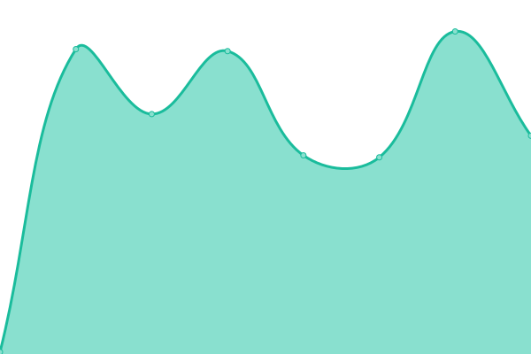

# [📈 Live Status](https://503stack.xyz/uptime): <!--live status--> **🟩 All systems operational**

This repository contains the open-source uptime monitor and status page for [503stack](https://503stack.xyz/uptime), powered by [Upptime](https://github.com/upptime/upptime).

With [Upptime](https://upptime.js.org), you can get your own unlimited and free uptime monitor and status page, powered entirely by a GitHub repository. We use [Issues](https://github.com/503stack/uptime/issues) as incident reports, [Actions](https://github.com/503stack/uptime/actions) as uptime monitors, and [Pages](https://503stack.xyz/uptime) for the status page.

<!--start: status pages-->
<!-- This summary is generated by Upptime (https://github.com/upptime/upptime) -->
<!-- Do not edit this manually, your changes will be overwritten -->
<!-- prettier-ignore -->
| URL | Status | History | Response Time | Uptime |
| --- | ------ | ------- | ------------- | ------ |
|  [Harbor](https://cr.fredhs.net) | 🟩 Up | [harbor.yml](https://github.com/503stack/uptime/commits/HEAD/history/harbor.yml) | 

 406ms
     
 | 

<a href="https://503stack.xyz/history/harbor">100.00%</a>
    

|  [Joplin](https://joplin.fredhs.net) | 🟩 Up | [joplin.yml](https://github.com/503stack/uptime/commits/HEAD/history/joplin.yml) | 

 538ms
     
 | 

<a href="https://503stack.xyz/history/joplin">100.00%</a>
    

|  [Minio](https://console.minio.fredhs.net) | 🟩 Up | [minio.yml](https://github.com/503stack/uptime/commits/HEAD/history/minio.yml) | 

 406ms
     
 | 

<a href="https://503stack.xyz/history/minio">100.00%</a>
    

|  [Privatebin](https://bin.fredhs.net) | 🟩 Up | [privatebin.yml](https://github.com/503stack/uptime/commits/HEAD/history/privatebin.yml) | 

 506ms
     
 | 

<a href="https://503stack.xyz/history/privatebin">100.00%</a>
    

|  [Harbor ipv6](https://cr.fredhs.net) | 🟩 Up | [harbor-ipv6.yml](https://github.com/503stack/uptime/commits/HEAD/history/harbor-ipv6.yml) | 

 110ms
     
 | 

<a href="https://503stack.xyz/history/harbor-ipv6">100.00%</a>
    

<!--end: status pages-->

[**Visit our status website →**](https://503stack.xyz/uptime)

## 📄 License

- Powered by: [Upptime](https://github.com/upptime/upptime)
- Code: [MIT](./LICENSE) © [Anand Chowdhary](https://anandchowdhary.com), supported by [Pabio](https://pabio.com)
- Data in the `./history` directory: [Open Database License](https://opendatacommons.org/licenses/odbl/1-0/)
